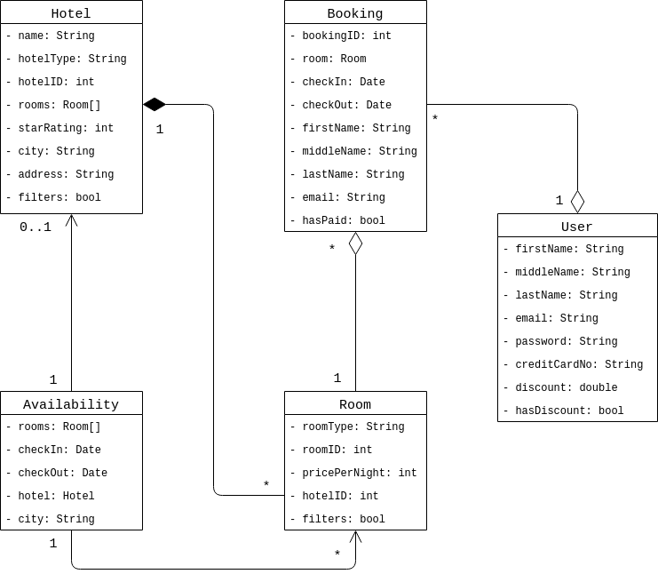

# A2: Domain Model

- *Jóhann Bjarki Hall*
- *Jóhannes Nordal*
- *Magnús Þór Valdimarsson*
- *Þorri Már Sigurþórsson*

## UML Class Diagram

The arrowhead to `Hotel` from
`Availability` has `0..1` next 
to it because `hotel` is an
optional parameter to `Availability`. 
We felt this was the most accurate
way to represent that relationship,
hopefully that assumption is 
appropriate. It should also
be noted that `filter` appears 
in both `Hotel` and `Room`, 
and is meant to be a placeholder
for any sort of boolean preference 
variable, e.g., `gym` in `Hotel` etc.

