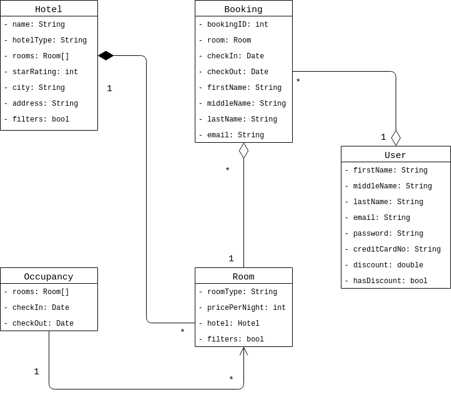

# A2: Domain Model

- *Jóhann Bjarki Hall*
- *Jóhannes Nordal*
- *Magnús Þór Valdimarsson*
- *Þorri Már Sigurþórsson*

## UML Class Diagram Revised

It should
be noted that `filter` appears 
in both `Hotel` and `Room`, 
and is meant to be a placeholder
for any sort of boolean preference 
variable, e.g., `gym` in `Hotel` etc.

